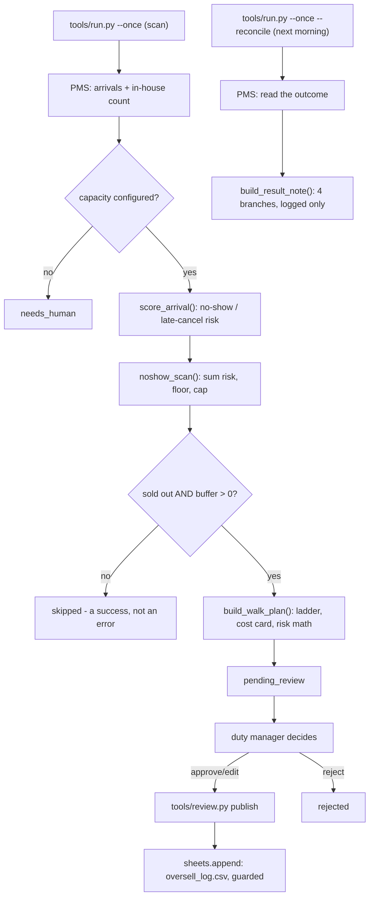

# Overbooking & No-Show AI — "The Juggler"

Predicts no-shows and late cancellations per night from booking history and lead-time patterns, recommends a safe controlled-overbooking level, and preps the walk plan (which booking, which partner hotel) if the night runs over.

## What it does

Predicts no-shows and late cancellations per night from booking history and
lead-time patterns, recommends a safe controlled-overbooking level, and
preps the walk plan (which booking, which partner hotel) if the night runs
over.

## What it won't do

Never walks a guest itself — the walk decision is the duty manager's. Stays
inside the risk band you set.

## Why it matters

Empty rooms from no-shows are pure lost revenue; uncontrolled overbooking is
a guest-experience disaster. This threads the needle with data.

## What to expect

A nightly sell-limit recommendation with predicted no-shows and a ready walk
plan.

The roster text above is quoted exactly as it appears on the demo platform's
agent menu — this repo does not promise more than that, and does not
promise less. ROI figure: `+2%` Occupancy on sold-out nights.

## Who it's for

Independent hotels that regularly sell out — city hotels on event weekends,
boutique properties with a fixed small room count, anywhere a single
no-show or a well-timed cancellation moves the night's economics. It
replaces the "gut feel plus a spreadsheet" version of controlled
overbooking, not the duty manager who actually decides to walk someone.

You will get the most from this repo if:

- You have a PMS or at least a CSV export that shows tonight's arrivals,
  in-house count, and room type rates.
- Your property genuinely sells out on some nights — this agent's
  recommendation is correctly 0 ("no oversell tonight") on every night that
  is not close to capacity, and that is by design, not a bug.
- You have (or are willing to negotiate) a standing relationship with at
  least one nearby partner hotel who can take a walked guest at short
  notice.
- You want the walk plan ready **before** 22:00, not improvised at the desk
  when a guest with nowhere to sleep is standing in front of you.

It is less of a fit if your property never sells out, or if a walk has never
once happened and controlled overbooking is not a risk you are willing to
take at all — in that case the risk scoring is still informative, but the
walk-plan half of this repo will simply never trigger.

## How it works

Every number is a formula, a threshold, or a table lookup — **this agent has
no LLM step anywhere**, unlike most of the family (see
`docs/how-it-works.md` "Design decisions" #0).



`tools/oversell_engine.py` is the whole decision engine and has no I/O in
it: plain dataclasses in, a recommendation and (when the night is sold out)
a walk plan out. `tools/run.py` is the only place that talks to the PMS and
the review guard. Full detail — the risk formula, the walk-disruption score,
the Poisson-binomial risk arithmetic, and the 11 design decisions taken
where the source this repo was built from left a gap — is in
`docs/how-it-works.md`.

### Modes

`mode: shadow` (the default) means the agent scores, recommends, and queues
— it never writes anywhere. `mode: live` means an **approved** buffer
actually publishes; nothing is ever published without that approval, in
either mode. See `workflows/90-go-live.md`.

### The review loop

A sold-out night with a buffer recommended waits in `pending_review` until a
human approves it, edits the buffer, or rejects it. `workflows/80-review.md`
covers the whole loop, including what happens when a publish is blocked.

### What runs when

| Job | Command | Cadence (default) | What it does |
|---|---|---|---|
| Scan | `python3 tools/run.py --once` | 18:00 daily | Scores arrivals, recommends a buffer, queues a walk plan if sold out. |
| Reconcile | `python3 tools/run.py --once --reconcile` | 09:00 daily | Reads back what actually happened. Never writes. |

`make schedule ARGS="--all"` prints the exact cron/launchd/systemd snippet
for both — see "Run it" below.

### Standalone, no child agents

None. The Juggler is a standalone, top-level agent — it shares the demo
platform's `/pricing` page with Revenue Management AI ("The Quant") but has
its own repo and its own engine.

## What you need

- **Python 3.11+** on your machine, or a small always-on box (a Mac, a
  Linux box, or a cheap VPS) if you want the schedule to run unattended.
- **A PMS reservations export or API access.** `csv` (any PMS that can
  export reservations, room types and rates) works out of the box. A
  built connector exists for Cloudbeds. No connector at all is fine to
  start — `make demo` runs entirely on bundled fixtures.
- **Your real room count and at least one walk partner relationship.**
  This agent needs to know what "sold out" means for your property, and
  who a walked guest goes to.
- **No Claude Code subscription or API key is required.** This agent has no
  LLM step — see "How it works" above.
- **Time:** about 20 minutes for the quick start and setup workflow below.
  A week or two of shadow-mode scans before you consider going live.

## Quick start (5 minutes, no credentials)

```bash
git clone https://github.com/th1-ai/overbooking-no-show-ai.git overbooking-no-show-ai
cd overbooking-no-show-ai
make setup
make demo
```

You should see a sold-out night (Hotel Aurora, an invented property), two
guests flagged over 50% no-show risk, the sum-and-floor arithmetic, a
recommended buffer of 2, a full walk plan (who moves first, why, and what it
costs), the demo's morning-after note, and finally:

```
DEMO OK — 1 items processed, 1 drafted, 0 sent (shadow)
```

`0 sent` is correct — a demo never publishes anything, whatever you approve
inside it. The item id printed will be different every run.

If you do not see `DEMO OK`, read `workflows/99-troubleshooting.md` before
going further.

### A worked example, from the demo

Twelve arrivals tonight against 12 rooms — sold out. Two guests carry more
than 50% no-show risk (an Expedia booking with no guarantee, booked 74 days
out, no phone or email on file; a similar Booking.com one). The sum of every
arrival's risk works out to 2.38 rooms, floored to 2 for a safe buffer,
capped well under the rule's limit of 3.

The walk plan's first pick is not the highest-risk guest — it is
`K. Larsen`: one night, walk-in, no loyalty, booked same day, only 2%
no-show risk. The formula protects loyalty members, long stays and direct
bookings first, and it deliberately avoids picking a guest who is themselves
likely not to show — "we want a plan for someone who will actually arrive."
The cost card prices the alternative honestly: a partner room at 95% of your
rate, plus a fixed taxi and goodwill credit, against the revenue the buffer
protects — in this example, `0.76x` covered, not the "4x" a fixed marketing
number might claim. See `docs/how-it-works.md` "Design decisions" #6 for why
this repo never prints an asserted ratio.

## Set up with Claude Code

Open `claude` in this folder and work through these prompts in order. Each
one names the workflow file Claude will follow.

**Phase 1 — first run.**
> Read `workflows/00-setup.md` and walk me through first-run setup for
> Overbooking & No-Show AI. Ask me for my hotel's name, real room count,
> currency, the PMS room type id the buffer should be priced off, and at
> least one walk partner hotel and its rate relative to mine.

**Phase 2 — connect your PMS (optional at first).**
> Read `docs/integrations.md` and help me connect our PMS. We use
> `<your PMS>` — start with the `csv` adapter if there is no built connector
> for it yet.

**Phase 3 — fill in the walk-partner protocol.**
> Read `knowledge/README.md` and help me fill in
> `knowledge/walk-partner-protocol.md` with the real phone numbers, account
> codes and after-hours contacts our duty managers will need.

**Phase 4 — run it for real.**
> Read `workflows/10-scan.md` and run a real scan. Show me what came out of
> it in plain language, not raw JSON.

**Phase 5 — work the review queue.**
> Read `workflows/80-review.md`. Walk me through the recommendation that is
> waiting, and help me decide whether to approve it, edit the buffer, or
> reject it.

**Phase 6 — check the morning after.**
> Read `workflows/11-reconcile.md` and run the reconcile pass. Tell me what
> the note says.

**Phase 7 — when you are ready, go live.**
> Read `workflows/90-go-live.md`, check the checklist against where we
> actually are, and tell me honestly whether we are ready.

## Connect your systems

Full detail, every env var, and the "implement your own" recipe:
`docs/integrations.md`. Summary for this agent specifically — it only ever
uses two of the family's adapters:

| System | Adapter | Status | What it needs |
|---|---|---|---|
| PMS | `mock` | universal | nothing — bundled fixtures, what `make demo` uses |
| PMS | `csv` | universal | a reservations/room-types/rates export in `data/imports/` — works with any PMS |
| PMS | `cloudbeds` | built | OAuth app + refresh token |
| Sheets | `csv` | universal | nothing — writes `data/exports/oversell_log.csv` |
| Sheets | `google` | built | a service-account JSON |

Email and Messaging are configured (for consistency across the family) but
**not used** — this agent has no guest inbox and sends no message to anyone,
ever. `pos`, `accounting`, `reviews`, `calendar`, `payments`, `procurement`
and `locks` are unused stubs, same as every repo in this family.

**Every column the risk engine reads from `data/imports/reservations.csv`:**
`id, status, check_in, check_out, room_type_id, room_type_name, room_id,
adults, children, source, total, balance, currency, guest_email,
guest_first_name, guest_last_name, guest_phone, guest_country, loyalty,
booked_days_ago, guaranteed`. The last three (`loyalty`, `booked_days_ago`,
`guaranteed`) feed the no-show risk formula directly and, unlike every other
column here, are read by exact lowercase key — see `docs/integrations.md`
"Connect your systems" for the exact rule and what a missing one silently
defaults to. `make doctor` names any of the three that your export is
missing.

Test any adapter change with:

```bash
make doctor
```

## Run it

```bash
make run                            # scan tonight (and horizon_nights ahead)
make run ARGS="--date 2026-09-15"   # a specific night
make run ARGS="--nights 7"          # a week at once
make run ARGS="--dry-run"           # compute and print, write nothing
make run ARGS="--reconcile"         # read back what happened last night
make watch                          # keep scanning on the configured interval
make review                         # what is waiting for a human
python3 tools/review.py show <id>
python3 tools/review.py approve <id>
python3 tools/review.py edit <id> --buffer 1 --note "<why>"
python3 tools/review.py reject <id> --reason "<why>"
python3 tools/review.py publish     # publish everything approved/edited
make report                         # what the agent recommended, and what happened
```

### Scheduling on a Mac, Linux box, or VPS

```bash
make schedule ARGS="--all"
```

prints one snippet per job in `config/agent.yaml: schedule:` (`scan` and
`reconcile`), for cron, launchd, or systemd — pick whichever fits your
machine. Examples for all three also live in `scheduler/`.

### No subscription-vs-API decision needed

Every other repo in this family asks you to pick an LLM provider (your
Claude Code subscription, or the Anthropic API). This agent has none of that
— nothing here ever calls a model, so there is no per-call cost, no rate
limit, and no subscription-usage-policy question to read. See
`docs/how-it-works.md` "Design decisions" #0.

## Go live

`workflows/90-go-live.md` has the full checklist. Short version: real
property details in `config/hotel.yaml`, a real `reference_room_type` and
real walk partners in `config/agent.yaml`, `knowledge/walk-partner-protocol.md`
filled in with real phone numbers, and a few real scans reviewed before you
flip:

```yaml
mode: live   # config/hotel.yaml
```

Going live means an **approved** buffer actually publishes to
`data/exports/oversell_log.csv` (or your Google Sheet). It does not change
who decides to walk a guest — that stays a human, at the desk, always. Flip
back to `mode: shadow` at any time to stop every publish on the next pass.

## Guardrails & safety

Full detail: `docs/safety.md`. The essentials:

- **`mode: shadow` blocks every write, approved or not.** The only way past
  it is `mode: live`, and even then only an approved item publishes.
- **This agent never walks a guest and never contacts one.** Structural, not
  a setting — there is no code path that does either, in shadow or in live
  mode.
- **A recorded no-show is never a walk candidate**, and **loyalty members
  and long stays are protected in the walk score**, ahead of channel or lead
  time.
- **The oversell cap is a hard ceiling** (`oversell.max_buffer`, default 3),
  regardless of how many no-shows are predicted.
- **No card data, no payments.** Taxi and goodwill costs are priced and
  logged; nothing here posts a charge, a refund, or a credit.
- **No LLM anywhere** — no prompt-injection surface, no hallucination risk,
  and nothing leaves this machine.

**AI-transparency note.** This agent produces no guest-facing text at all —
it never drafts a message, never replies to a review, never emails anyone.
The EU AI Act Article 50 disclosure requirement (telling a person they are
interacting with an AI system) does not apply to this repo's own output for
that reason; if your property uses another agent in this family that does
write to guests, that repo's own README covers the disclosure line.

## Customising

- **Risk weights** — `config/agent.yaml: risk:` — every point value in the
  no-show/late-cancellation formula (channel, guarantee status, lead time,
  loyalty, contactability). See `docs/how-it-works.md` "The no-show /
  late-cancellation risk model" before changing these.
- **Oversell cap and rule** — `config/agent.yaml: oversell.max_buffer` and
  `rules.oversell_buffer`. The rule OFF forces buffer 0 whatever the
  prediction says.
- **How many nights ahead** — `config/agent.yaml: horizon_nights` (default
  1). Raise it once you trust the recommendation to get a week of sell
  limits in one scan: `python3 tools/run.py --once --nights 7`.
- **Walk partners and cost card** — `config/agent.yaml: walk.partners`
  (ranked list, name + rate_multiplier), `walk.taxi_cost`,
  `walk.goodwill_credit`.
- **Late-cancellation window** — `config/agent.yaml:
  late_cancellation_hours` (default 48). A cancellation inside this window
  counts as a no-show for tonight's capacity.
- **The walk-partner protocol note** — `knowledge/walk-partner-protocol.md`
  — for humans, not code. See `knowledge/README.md`.

There is no prompts folder, no language setting, and no signature block
to customise — this agent has no LLM step and produces no guest-facing text.
See `docs/how-it-works.md` "Design decisions" #0.

## Troubleshooting & FAQ

`workflows/99-troubleshooting.md` has the full list. Common ones:

**"`make doctor` says hotel identity FAIL."** Expected on a fresh clone —
edit `config/hotel.yaml` with your real property name.

**"A night I know was sold out was not flagged."** `sold_out` is
`capacity > 0 and otb_rooms >= capacity`, where `capacity` is
`hotel.rooms`. If you hold rooms back for maintenance or long-stay guests,
that number may need to be your sellable room count, not your physical one.

**"No walk plan even though the buffer is above 0."** Check whether
`rules.oversell_buffer` is off — that forces the buffer, and therefore the
plan, to nothing.

**"Why does `make run` never ask me anything?"** There is no `interactive`
LLM provider here to answer — every number is computed directly. This is
the one repo in the family where that is true.

**"Can this agent decide who actually gets walked?"** No, and it never
will — see "Guardrails & safety" above.

**"What if my PMS already has an overbooking feature?"** Nothing here
conflicts with it. This agent recommends a number and prices the walk;
whatever mechanism you use to actually raise the sell limit (your PMS's own
inventory screen, a channel manager, a spreadsheet) still applies it. The
published row in `data/exports/oversell_log.csv` is the audit trail either
way.

**"Why is `nights_scanned` in `make report` low even after weeks of
running?"** Every scan of the same still-undecided night updates one item,
it does not create a new one — see `docs/how-it-works.md` "Idempotency and
pinning". `nights_scanned` counts distinct nights, not runs.

## Measuring the benefit

```bash
make report
python3 tools/report.py --json
```

Nights scanned, sold-out nights, no-oversell nights, rooms recommended vs
rooms actually published, and the recent morning-after notes. Full detail
and honest caveats (the risk score is a formula, not a trained model; the
coverage ratio is always the real computed number, never an asserted
multiple): `docs/benefits.md`.

## About

Built by [TH1](https://th1.ai) — AI agents for independent hotels.
Licensed MIT, see `LICENSE`. Part of a family of 28 template repos, one per
agent on TH1's demo platform; `docs/how-it-works.md` lists the design
decisions specific to this one.

**Want it run for you, tuned to your property, with the walk-partner
relationship already negotiated?** [th1.ai](https://th1.ai) does that as a
managed service.

**Changelog.** v1.0 — initial release: deterministic no-show/late-cancellation
risk scoring, the oversell recommendation, the walk plan, and the
morning-after reconcile. No LLM step.
