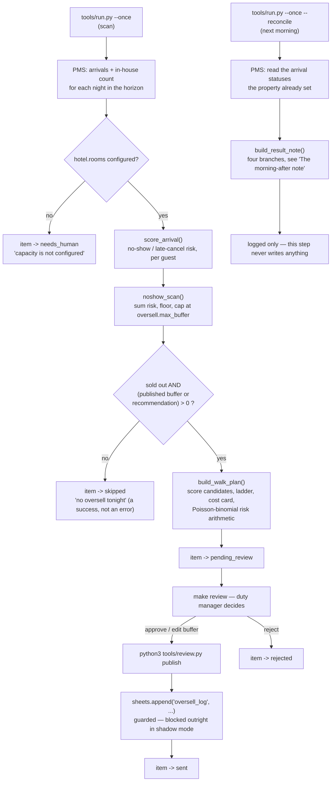

# How Overbooking & No-Show AI works

## In one paragraph

Every scan reads tonight's (and, if you raise `horizon_nights`, the next few
nights') arrivals from your PMS, scores each one for the chance the room does
not get used (a no-show or a late cancellation), sums that risk, and floors it
to a safe buffer capped at 3 rooms. If the night is sold out and a buffer is
recommended, it builds a walk plan: who moves first if everyone shows up
anyway, where they go, and what it costs — all before the duty manager has to
decide anything. Nothing is published until a person approves it, and the
agent never contacts a guest or touches a reservation. The next morning it
reads back what actually happened and writes one plain-language note: did the
buffer pay off, or did rooms stand empty.

Every number above is deterministic — a formula, a threshold, or a table
lookup. **This agent has no LLM step at all** — see "Design decisions" #0.

## The loop



## What runs when

| Job | Command | Cadence (default) | Reads | Writes |
|---|---|---|---|---|
| Scan | `python3 tools/run.py --once` | 18:00 daily | PMS arrivals, in-house count, rates | queues a recommendation item only |
| Reconcile | `python3 tools/run.py --once --reconcile` | 09:00 daily | PMS arrival statuses (already set by the property) | nothing — read-only, logs the result note |
| Publish | `python3 tools/review.py publish` | on demand, after a human approves | — | one guarded export row (`data/exports/oversell_log.csv`, or your Google Sheet) |

Both scheduled jobs are in `config/agent.yaml: schedule:` — `make schedule
ARGS="--all"` prints the exact cron/launchd/systemd snippet for each, and
README §9 shows that same output. There is no LLM step to schedule.

## The no-show / late-cancellation risk model

`does` promises prediction "from booking history and lead-time patterns." The
source this repo generalises from does not actually compute that — `risk_pct`
is a seeded column in the demo (see "Design decisions" #1). This template
ships a real, deterministic scoring formula instead, built only from fields a
PMS already gives you: channel, guarantee status, lead time, loyalty, and
whether the guest is contactable.

```
risk_pct = clamp(
    risk.base_pct
    + channel_pts(channel)                 # config: risk.channel_pts, default risk.ota_default_pts
    + (risk.guarantee_pts.guaranteed if guaranteed else risk.guarantee_pts.not_guaranteed)
    + lead_time_pts(booked_days_ago)         # same-day / short / medium / long bracket
    + (risk.loyalty_pct if loyalty else 0)
    + (risk.uncontactable_pct if not contactable else 0),
    risk.min_pct, risk.max_pct
)
```

Every term is a config knob in `config/agent.yaml: risk:` — a hotel that
disagrees with the weights edits the numbers, not the code. `score_arrival()`
in `tools/oversell_engine.py` also builds the human-readable `basis` string
naming which factors fired ("OTA booking, no guarantee on file, booked 74
days out"), mirroring `noshow_tonight.basis` in the source.

**Late cancellations** (open question #8) are folded into the same score
rather than modelled separately: a reservation already cancelled within
`late_cancellation_hours` (default 48) of its check-in is not excluded from
tonight's list — it is scored at a locked 100% ("cancelled 30h before
arrival — counts as a no-show for tonight's capacity"), because the effect on
tonight's room count is identical to a no-show. `tests/test_oversell_engine.py`
has a dedicated case for this.

## The oversell recommendation

`noshow_scan()` is a direct, literal port of `runOverbookScan`:

1. **Score tonight's arrivals** (above). Step-1 text: "*{n} arrivals scored on
   guarantee, contact history and booking pattern. {k} carry a no-show risk
   above `risk.high_threshold`%.*"
2. **Expected no-shows.** `expected = sum(risk_pct / 100 for every arrival)`.
   `predicted = floor(expected)` — floor, not round, "for a safe buffer."
3. **Recommendation** — rule `rules.oversell_buffer`:
   - **ON**: `recommended = min(predicted, oversell.max_buffer)` (default cap
     3, matching the spec; raise it in config if your property wants more
     rope — see "Design decisions" #3).
   - **OFF**: `recommended = 0`, "Controlled overbooking is disabled by rule
     — no oversell tonight, whatever the prediction says."

A recommendation of 0 is queued `skipped`, not `pending_review` — there is
nothing to publish, and the family convention is that an informational item
never sits in the human queue (see `core/review.py` and the go-live
checklist). It is still logged, and `make report` counts it: restraint is a
result worth reporting, not a silent no-op.

## The walk plan

Built only when the night is sold out **and** a buffer (published or
recommended) is above zero. `build_walk_plan()` returns `None` otherwise —
overselling a night with rooms left is meaningless, and there is nothing to
show.

**Candidates.** Every arrival except one already resolved as `no_show`
(structurally excluded — a no-show cannot be walked) or `cancelled`.

**The disruption score — lower walks first**, exactly the formula from the
source (`tools/oversell_engine.py:walk_score`):

```
score = nights * 4                          # a long stay breaks worst
      + (10 if loyalty else 0)              # never move a member if avoidable
      + (6 if channel == "Direct" else 0)   # our own booking, our own promise
      + min(booked_days_ago, 30) / 10       # capped so a 90-day-out booking can't dominate
      + risk_pct / 20                       # a likely no-show is a wasted relocation
```

`walk_reasons()` emits the five plain-language lines from the spec (stay
length, channel, loyalty, booking age, risk band); `walk_why()` compresses
them into the one-line "why them." The ladder is the lowest-scoring three,
picked first.

**The cost card.** `partner_rate = round_to_5(classic_rate * partner_multiplier)`;
`cost_per_guest = partner_rate + walk.taxi_cost + walk.goodwill_credit`. The
walk partner is `walk.partners[0]` in config — a ranked list, so a second
choice exists, but **availability is never checked** (open question #5): call
ahead before confirming. The reference rate is `reference_room_type`'s tonight
rate, read straight from the PMS with `get_rates()` — no separate "rate
engine" to port.

**The risk arithmetic** (`noshow_distribution()`). The exact Poisson-binomial
distribution of "how many of tonight's arrivals fail to show," by iterative
convolution: `dist[k] = dist[k]*(1-p) + dist[k-1]*p` for each guest's
independent risk `p`. From that:

```
walk_risk_pct     = P(at least one guest must be walked) = sum(dist[k] for k where buffer - k < 0)
expected_walks    = sum(dist[k] * max(0, buffer - k) for all k)
worst_case_cost   = buffer * cost_per_guest
protected_revenue = buffer * classic_rate
expected_net      = (buffer - expected_walks) * classic_rate - expected_walks * cost_per_guest
```

**The coverage ratio is always computed, never asserted** (open question #6:
the source's fixed "~4x" copy disagreed with its own math). This template
prints `protected_revenue / worst_case_cost` — whatever that number actually
is, even when it is under 1x.

## The morning-after note

`build_result_note()` — four branches, matching the spec verbatim in shape
(names and numbers are computed, not templated text):

- No no-shows, buffer > 0 → the buffer had to be relocated elsewhere.
- No no-shows, buffer 0 → "buffer 0 was the right call."
- No-shows, no buffer → the rooms stood empty; the note prices the loss.
- No-shows with a buffer → how many absorbed, revenue recovered, walks (if
  any) still needed.

This only ever **reads**. In production the property's own night audit
already marks a booking `arrived` or `no_show` — this agent does not do that
(see "Design decisions" #7); `tools/run.py --once --reconcile` reads the
result back the next morning and writes the note to the log. `tools/demo.py`
fabricates the same ≥50%-risk rule directly on its in-memory copy of the
fixtures, purely so the zero-credential demo can show the whole story without
a second day passing — it never calls a PMS write either.

## Data model

No extra SQLite tables — this agent needs none. One `core.store` `items` row
per night: `kind="oversell_recommendation"`, `source="pms"`,
`external_id=<date>` (so `store.upsert_item()`'s built-in `(source,
external_id)` dedup is exactly "one row per night," no extra ledger key
needed). `payload` holds the latest scored arrivals and scan steps; `draft`
holds the pinned recommendation (buffer, walk plan, cost card) a human is
actually deciding on — see "pinning" below. `intent` is always
`"oversell_recommendation"`.

```
new ──(recommended > 0)──▶ pending_review ─┬─ approve/edit ─▶ approved ─▶ sending ─▶ sent
    └─(recommended = 0,                    │                                          │
       or nothing sold-out to decide)──▶   └─ reject ────────▶ rejected               │
                skipped (terminal)                                          WriteBlocked in
                                                                             shadow mode reverts
                                                                             to approved (kept)
```

## Idempotency and pinning (open question #10)

The spec's walk plan is "derived on every render" so a reset has nothing to
undo — but that also means a plan a duty manager saw at 20:00 could silently
change if a later row changes, which is the exact risk open question #10
flags. This template resolves it with one rule, enforced in `tools/run.py`:

- **First scan of a night** (`store.get_by_external("pms", date)` returns
  `None`): create the item, compute the recommendation, set it as `draft`,
  and transition to `pending_review` or `skipped`.
- **Re-scan while still undecided** (`review_status` is `pending_review` or
  `needs_human`): recompute and overwrite `draft` — a night that has not been
  decided yet should stay current as new bookings and cancellations land.
- **Re-scan after a human has acted** (`approved`, `edited`, `rejected`,
  `sending`, `sent`, `stale`, or already `skipped`): **do not touch it.** The
  plan the duty manager approved is exactly the plan that gets published.

`upsert_item()`'s own payload-refresh (used for the "latest arrivals" view,
separate from the pinned `draft`) already preserves any `_`-prefixed cache key
across a refresh — this agent does not need one, since there is no LLM stage
to cache, but the mechanism is there if a future sub-agent needs it.

Re-running `tools/run.py --once` twice on the same day is a no-op past the
first pending item per night (`tests/test_run_loop.py`,
`test_rerun_the_same_day_is_idempotent`); a new day gets a fresh item because
`external_id` is the date.

## Design decisions

**#0 — No LLM anywhere, at all.** The spec is explicit (§6, §13): "No LLM
anywhere. No prompt, no narrative route; the result note is a deterministic
template." Every other repo in this family uses `core/llm.py` for at least the
prose; this one does not, because there is no free text to draft, no guest to
write to, and no ambiguous judgement call — every output is a formula over
seeded, real PMS data. Consequences: no `prompts/` directory, no
`fixtures/expected/` (nothing for the `mock` provider to answer), and
`tools/doctor.py`'s LLM check still runs (it is generic) but nothing in this
agent depends on its result.

**#1 — A real risk model ships, replacing the seeded `risk_pct` column.** See
"The no-show / late-cancellation risk model" above. The alternative the spec
allowed — "state that risk comes from the PMS" — would make the `does`
promise false for any PMS that does not compute it, which none do today.

**#2 — Top-level, standalone repo.** Per the brief: no parent, no children.
The Juggler shares the demo's `/pricing` page and `pricing-engine.ts` file
with Revenue Management AI ("The Quant"), but the roster lists them as
siblings, not parent/child, and the walk-plan logic does not depend on
anything in the Quant's repricing engine — only on tonight's rate, which it
reads from the PMS directly.

**#3 — The oversell cap is configurable, not hard-coded.** `oversell.max_buffer`
(default 3, matching the spec's canonical example). This is not the "risk
band" the `cant` text alludes to ("stays inside the risk band you set") —
there still isn't one, and this is still a single global cap, not a
per-night or seasonal one. Honest limitation, now at least a config knob
instead of a literal `3` in the code.

**#4 — Multi-night scanning.** `horizon_nights` (default 1, matching the
spec's single-night story) scans `[today .. today + horizon_nights - 1]` in
one pass, one item per night. `python3 tools/run.py --once --nights 7` tries
a week. `pricing_oversell`'s `day_offset` column in the source hints at this
but only offset 0 is ever read; this template implements it for real.

**#5 — Partner hotels are a ranked config list, availability still assumed.**
`walk.partners` takes more than one entry; the plan always uses the first.
Checking live availability at a specific partner needs their own booking
system or a phone call — out of scope for a template with no such adapter to
port. Documented in `docs/integrations.md`.

**#6 — The coverage ratio is always the real number.** See "The risk
arithmetic" above — the spec's own worked example shows its fixed "~4x" copy
disagreeing with its own math (0.9x). This template never prints a number it
did not just compute.

**#7 — The agent never marks a reservation `arrived` or `no_show`.** That is
the property's own PMS/night-audit process, and spec §6 is explicit: "no
reservation mutation." `tools/run.py --once --reconcile` only reads. Only
`tools/demo.py` fabricates the ≥50%-risk outcome, and only on an in-memory
copy of the fixtures, for the zero-credential demo.

**#8 — Late cancellations folded into the same risk score.** See above.

**#9 — Taxi and goodwill are config, formatted in `hotel.currency`.**
`walk.taxi_cost` / `walk.goodwill_credit` default to the spec's €18 / €50 but
scale to whatever currency the hotel configures — `format_money()` never
hard-codes a symbol. Still priced, never posted to a ledger (payments/
accounting adapters are stubs and this agent never calls them).

**#10 — Draft pinning.** Covered above under "Idempotency and pinning."
